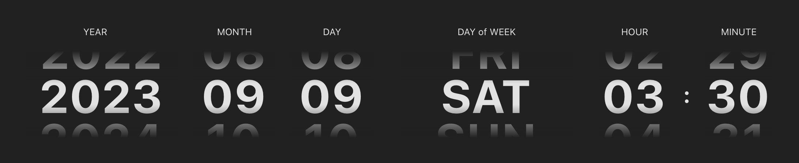

# Day 04

## Challenge description



Use CSS Scroll Snap to create a clock which showcases the following time details:

- Year
- Month 
- Day 
- Day of the week (SUN, MON, TUE, WED, THU, FRI, SAT)
- Hour (in 24-hour format)
- Minute

Requirements:

- [ ] This clock initially displays the user's local time
- [x] The user is able to scroll to adjust the time

TODO:

- [ ] Unit tests

## Getting Started

### Use PNPM to install dependencies

```bash
pnpm install
```

### Use PNPM to develop

```bash
pnpm --filter day-04 dev
pnpm --filter day-04 test:dev
```

### Use Bazel to build and test

```bash
bazel build //challenges/day-04:build
bazel test //challenges/day-04:ut_test
```

## References

- Docs: [MDN - CSS Scroll Snap](https://developer.mozilla.org/en-US/docs/Web/CSS/CSS_scroll_snap)
- Article: [Practical CSS Scroll Snapping](https://css-tricks.com/practical-css-scroll-snapping/)
- Article: [Well-controlled scrolling with CSS Scroll Snap](https://web.dev/css-scroll-snap/)
